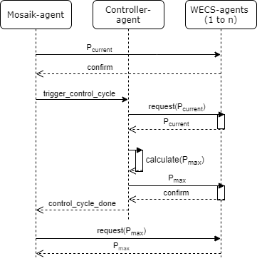

# The mango-mosaik-demo
This example demonstrates how to couple a multi-agent-system (MAS) 
written in [mango](https://gitlab.com/mango-agents/mango) to a [mosaik](https://gitlab.com/mosaik) 
simulation.

In this example the following is covered:  
- Writing a simple, controllable simulator and coupling it with mosaik using
the [mosaik-api](https://mosaik.readthedocs.io/en/latest/mosaik-api/high-level.html) package. 
- Writing a *simple* MAS with mango and couple it *by* using the
  *mosaik-api* package, including:

  - Forward data from mosaik to your agents

  - Collecting set-points/schedules from agents and send them to mosaik as
    input for the controlled simulator.

And what not?

- Packaging and Deployment of your system

- Testing (neither unit nor system/integration testing)

- Fancy distributed algorithms

- Fancy agent architecture that makes it easy to change the planning algorithm
  or lets agents communicate with simulated models or real resources.

This document explains how to install and run the example project.
It also gives you a rough idea how the scenario looks like and discusses
the basic ideas behind the controlled simulator 
and the controlling multi-agent system.  
In-depth comments and discussions are within the source code itself, because
you have to read it anyways if you want to learn something.  :)

## Content

* Scenario
* Installation and execution
* The mosaik scenario explained
* The MAS explained
* The WECS simulator explained

## The Scenario
The simulation consists of three components:

* A wind energy conversion system (WECS) simulator
* A multi-agent system with one agent for each simulated WECS and one central
controller agent
* An HDF database “simulator” that collects some data from the WECS simulator

In this scenario, the WECS form a small wind farm. The agents observe the
power output of their WECS. A controlling agent regularly collects the recent
feed-in from the WECS agents and checks if it is above a certain maximum power
feed-in for the wind farm. If the combined power output of the WECS is above
the limit, the controller calculates the maximum allowed power output for each
WECS and sends it to the WECS agents which forwards it to the actual WECS.
A database collects the wind speed, active power output and the power limit
for each simulated WECS.
This scenario is actually very dumb, but it has all the data-flows that 
would exist in a “real” project.

## Installation and execution
This example projects requires Python 3.8 or higher and a compiler. 
We suggest creating a virtualenv which can create isolated Python environments
for different projects. We also recommend to use 
[virtualenvwrapper](https://virtualenvwrapper.readthedocs.io/en/latest/) which
simplifies your life with virtualenvs.

Once your virtualenv is running you can `cd` into the project directory
and install all requirements:

`$ pip install -r requirements.txt`

You can then run the simulation by executing:

`$ python scenario.py`

The output should look like this:
>Starting "WecsSim" as "WecsSim-0" ...  
Starting "MAS" as "MAS-0" ...  
Agent main_container created  
Starting "DB" as "DB-0" ... 
INFO:mosaik_api:Starting MosaikHdf5 ...
Starting simulation.  
Simulation finished successfully.  

Now you have successfully completed the simulation.
The hdf5 result file can be found in `mango-mosaik-demo/data/mosaik_results.hdf5`

## The mosaik scenario explained
The scenario defined in `scenario.py` is a standard mosaik scenario. It
defines a `main()` that is executed when you run the script from the command
line.

It starts the three components involved in our simulation: the WECS simulator,
the multi-agent system and an HDF5 database to collect some data.

The wind data for the WECS simulator can be found in the CSV file in the
`data/` directory. This is also the place where the HDF5 database will be
created.

## The multi-agent system (MAS) explained
The MAS is located in `src/mas`. The file `mosaik.py` contains the entry 
point for starting the MAS. It implements the 
[mosaik-high-level-api](https://mosaik.readthedocs.io/en/latest/mosaik-api/high-level.html).
Apart from the class `MosaikAPI` which, as its name suggests, implements the 
mosaik API, there is also a class `MosaikAgent`.

The multi-agent system consists of multiple WECS agents (one for each simulated
WECS) and a central controller agent.

The MosaikAgent and Controller (located in `controller.py`) run in the
same container, while the WECS agents run in a separate container.

The following diagram describes the message exchange between 
the agents during every mosaik step.

## The WECS simulator explained
You can find the wind energy conversion system (WECS) simulator in
`src/wecssim/`.

The simulation model itself is define in `src/wecssim/wecs.py`.  It only
contains the class `wecssim.sim.WECS` with the simulation model.

The module `src/wecssim/mosaik.py` implements the mosaik API for the
simulator and also serves as an entry point: If you execute `PYTHONPATH=src/
python -m wecssim.mosaik`, the function is `wecssim.mosaik.main()` is called.
The mosaik documentation provides a 
[detailed description](https://mosaik.readthedocs.io/en/latest/mosaik-api/index.html) 
of how all that works.

There are also some tests for the WECS simulator. They are located in the
`tests/` directory and can be run via pytest:

`$ PYTHONPATH=src py.test`
