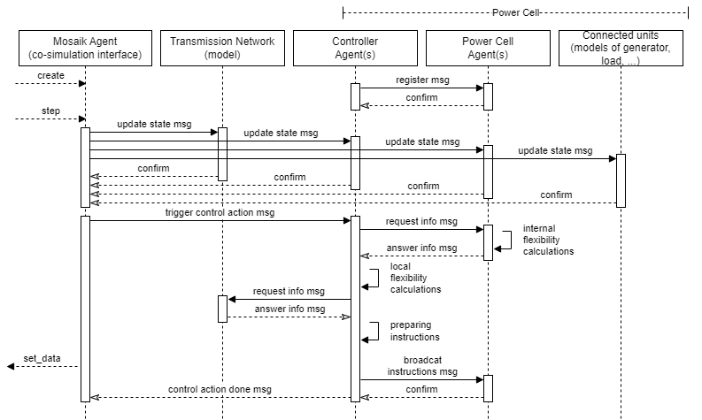

# The mosaik power cell agents

It is a prototype of multi-agent system simulator (MASS) combining [mango](https://mango-agents.readthedocs.io/en/latest/) agents and [mosaik](https://mosaik.readthedocs.io/en/latest/) co-simulaion platform for the sake of implementing the power cell model. It was inspired by [mosaik-mango-demo](https://gitlab.com/mosaik/examples/mosaik-mango-demo), we also integrated a wind power simulator.

## Content
* The mosaik scenario explained
* Installation and execution
* The multi-agent system explained
* The power cell concept

## The Scenario
The simulation scenario consists of two components:

* A power grid that is modeled with pandapower, and a wind power simulator
* A multi-agent system with one agent for each simulated entity, two agents representing the aggregate (cellular) level, and one core agent serving the mosaik interface.

In this scenario agents observe the power output and flexibility provided by associated entities such as generator, load etc. Cell agents aggregate the output from connected agents and then pass it among themselves to develop internal instructions. The mosaik agent provides updates from entities to its associated agents, triggers a communication cycle, and broadcasts instructions. For simplicity, mosaik synchronously updates the agents with data from associated entities.

## Installation and execution
Install all requirements:

`$ pip install -r requirements.txt`

Run the simulation by executing:

`$ python scenario.py`

The output should look like this:
>Starting "WecsSim" as "WecsSim-0" ...  
Starting "Grid" as "Grid-0" ...  
Starting "MAS" as "MAS-0" ...  
...
Starting simulation.  
Simulation finished successfully.  

## The multi-agent system explained
The multi-agent system (MAS) is located in `mosaik_agents.py`. It contains the entry point for starting the MAS. Apart from the class `MosaikAgents` which implements [mosaik-high-level-api](https://mosaik.readthedocs.io/en/latest/mosaik-api/high-level.html), there is also a class `MosaikAgent` which supports the communication between mosaik and MAS itself.

MAS consists of several `Agent`'s, one for each modeled entity and one for each modeled power cell. For simplicity, all agents run in the same mango container. 

The following diagram describes the message exchange between the agents during every mosaik step.

## The PowerCell concept
In implementing the power cell model and its communication layer, we followed the general concept of an energy/power cell, which is described in:
* [https://doi.org/10.1049/iet-gtd.2019.0991] A smart power cell (SPC) is a grid subsection composed of a set of power conversion units interconnected by a 3-phase AC-grid. The monitoring and control system can supervise the behavior of SPCs only taking aggregated information regarding their interfaces into account and issue aggregated control instructions when the behavior of a particular SPC at a particular transmission network bus needs to be adjusted to influence the operating state of the transmission network.
The main internal objectives: to supervise the voltage profiles, loading limits, local stability limits, to optimize the operation of the SPC according to technical and economic criteria.
The main external objectives: to coordinate the dynamic behavior in a supportive way, the flexibility to deliberately influence the active and reactive power exchange with the transmission network, to estimate and provide forecasts of the available flexibility, to adjust the active and reactive power flow exchanged with the transmission network etc.
* [https://doi.org/10.1186/s42162-022-00243-2] An energy cell (EC) encapsulates geographically or structurally coherent parts of an energy system of any scale. In EC there are a producer, a consumer, and a storage component which are connected to a controller agent which can exchange energy and information. The controller might be local which is localized on the top of some cell component or can be hierarchical that is considered as an agent outside certain cells and able to control a number of cells. The goal of an EC (and a controller) is to fulfill its own needs but is furthermore able to exchange energy with connected ECs.