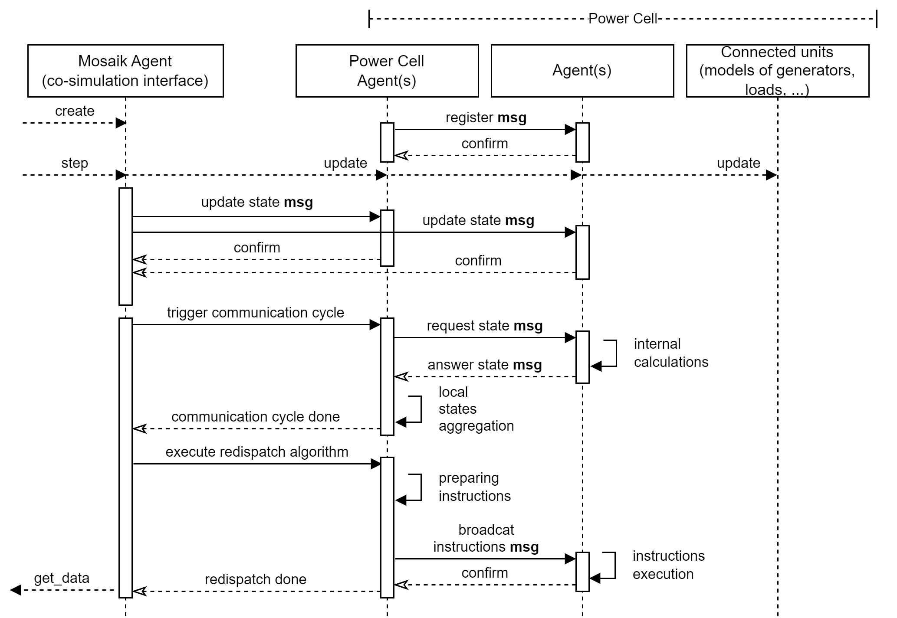
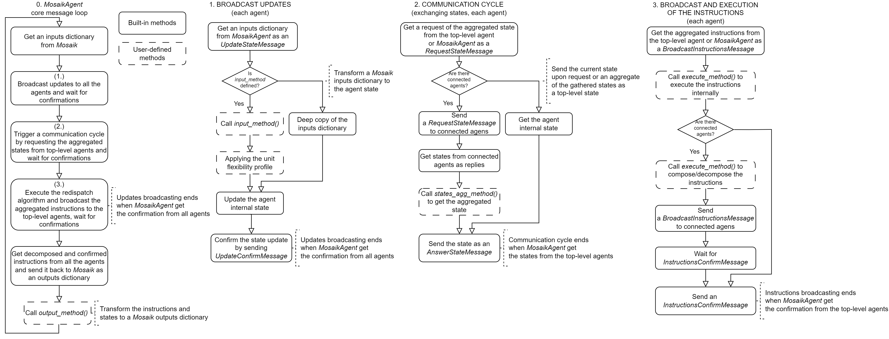

# The mosaik power cell agents

It is a prototype of multi-agent system simulator (MASS) combining [mango](https://mango-agents.readthedocs.io/en/latest/) agents and [mosaik](https://mosaik.readthedocs.io/en/latest/) co-simulaion platform for the sake of implementing the power cell model. It was inspired by [mosaik-mango-demo](https://gitlab.com/mosaik/examples/mosaik-mango-demo), we also integrated a wind power simulator.

## Content

* The power cell concept
* The multi-agent system explained
* The example scenario explained
* Installation and execution
* How to use


## The PowerCell concept

In implementing the power cell model and its communication layer, we followed the general concept of an energy/power cell, which is described in:
* [https://doi.org/10.1049/iet-gtd.2019.0991] A smart power cell (SPC) is a grid subsection composed of a set of power conversion units interconnected by a 3-phase AC-grid. The monitoring and control system can supervise the behavior of SPCs only taking aggregated information regarding their interfaces into account and issue aggregated control instructions when the behavior of a particular SPC at a particular transmission network bus needs to be adjusted to influence the operating state of the transmission network.
The main internal objectives: to supervise the voltage profiles, loading limits, local stability limits, to optimize the operation of the SPC according to technical and economic criteria.
The main external objectives: to coordinate the dynamic behavior in a supportive way, the flexibility to deliberately influence the active and reactive power exchange with the transmission network, to estimate and provide forecasts of the available flexibility, to adjust the active and reactive power flow exchanged with the transmission network etc.
* [https://doi.org/10.1186/s42162-022-00243-2] An energy cell (EC) encapsulates geographically or structurally coherent parts of an energy system of any scale. In EC there are a producer, a consumer, and a storage component which are connected to a controller agent which can exchange energy and information. The controller might be local which is localized on the top of some cell component or can be hierarchical that is considered as an agent outside certain cells and able to control a number of cells. The goal of an EC (and a controller) is to fulfill its own needs but is furthermore able to exchange energy with connected ECs.

## The multi-agent system explained

The multi-agent system (MAS) is located in `mosaik_agents.py`. It contains the entry point for starting the MAS. Apart from the class `MosaikAgents` which implements [mosaik-high-level-api](https://mosaik.readthedocs.io/en/latest/mosaik-api/high-level.html), there is also a class `MosaikAgent` which supports the communication between mosaik and MAS itself.

MAS consists of several `Agent`'s, one for each modeled entity and one for each modeled power cell. For simplicity, all agents run in the same mango container. 

The following diagram describes the message exchange between the agents during every mosaik step.



The following diagram describes the core flow and the following loops.



## The example scenario

### Scenario

The simulation scenario consists of two components:

* A power network that is modeled with pandapower and a set of PV/Wind power simulators that are linked to generators in the network. 
* A multi-agent system with one agent for each simulated entity, *n* agents representing the aggregate (cellular) level, and one core agent serving the mosaik interface.

In this scenario agents observe the power output and flexibility provided by associated entities such as generator, load etc. Cell agents aggregate the output from connected agents and then pass it among themselves to develop internal instructions. The mosaik agent provides updates from entities to its associated agents, triggers a communication cycle, and broadcasts instructions. For simplicity, the mosaik synchronously updates the agents with data from associated entities.

### Time complexity

Since the aggregation function at each hierarchical level is simply the summation of flexibility measurements that are passed as agent states, and the scenario itself has no recursion (or at least no somehow increasing recursion depending on the number of cells), the time complexity must be *O(n)*. According to the hierarchy of a multi-agent system, there is usually one top agent per cell (cell agent) and a number of agents below it, so the complexity is ~ *O(2\*n)* where *n* is the number of agents. In the case of a deep hierarchy, the complexity will be as BFS *O(b^d)*, where *b* is the branching factor and *d* is the depth of the hierarchy.

## Installation and execution

Install all requirements:

`$ pip install -r requirements.txt`

Run an example scenario by executing:

`$ python scenario.py`

The output should look like this:
>Starting "WecsSim" as "WecsSim-0" ...  
Starting "Grid" as "Grid-0" ...  
Starting "MAS" as "MAS-0" ...  
...
Starting simulation.  
Simulation finished successfully.  

## How to use

Import modules and specify simulators configurations within your scenario script:
```
from mosaik_agents import *
from utils import *

SIM_CONFIG = {
    'Grid': {
         'python': 'mosaik_components.pandapower:Simulator'
    },
    'MAS': {
        'python': 'mosaik_agents:MosaikAgents'
    },
...
}
```

We recommend one to configure top-level agents (cell agents) and regular agents separately:
```
AGENTS_CONFIG = [
    (2, {}), # here we configure two agents with empty parameters
    (2, {}), # other two
]

CONTROLLERS_CONFIG = [
    (2, {}), # and also two top-level agents that are named as controllers
]
```

Initialize the pandapower grid and MAS simulator:
```
    world = mosaik.World(SIM_CONFIG)
    gridsim = world.start('Grid', step_size=STEP_SIZE)
    mas = world.start('MAS', **MAS_DEFAULT_CONFIG)
```

Instantiate model entities and agents:
```
    grid = gridsim.Grid(json=GRID_FILE)
    mosaik_agent = mas.MosaikAgents()   # core agent for the mosaik communication 

    controllers = []
    for n, params in CONTROLLERS_CONFIG:  # iterate over the config sets
        controllers += mas.MosaikAgents.create(num=n, **params)

    agents = []
    for n, params in AGENTS_CONFIG:
        if len(agents) == 0: # connect the first couple of agents to the first controller
            params.update({'controller' : controllers[0].eid})
        else:
            params.update({'controller' : controllers[1].eid})
        agents += mas.MosaikAgents.create(num=n, **params)
```

Connect and run:
```
    gens = [e for e in grid.children if e.type in ['Gen', 'ControlledGen']]
    ext_grids = [e for e in grid.children if e.type in ['ExternalGrid']]
    loads = [e for e in grid.children if e.type in ['Load']]

    world.connect(gens[0], agents[0], ('P[MW]', 'current'))
    world.connect(loads[0], agents[1], ('P[MW]', 'current'))
    world.connect(gens[1], agents[2], ('P[MW]', 'current'))
    world.connect(loads[1], agents[3], ('P[MW]', 'current'))
    world.connect(ext_grids[0], mosaik_agent, ('P[MW]', 'current')) # connect the external network to the core agent
                                                                    # to execute the default redispatch algorithm
                                                                    # which is based on the core agent state
    world.run(until=END)
```

